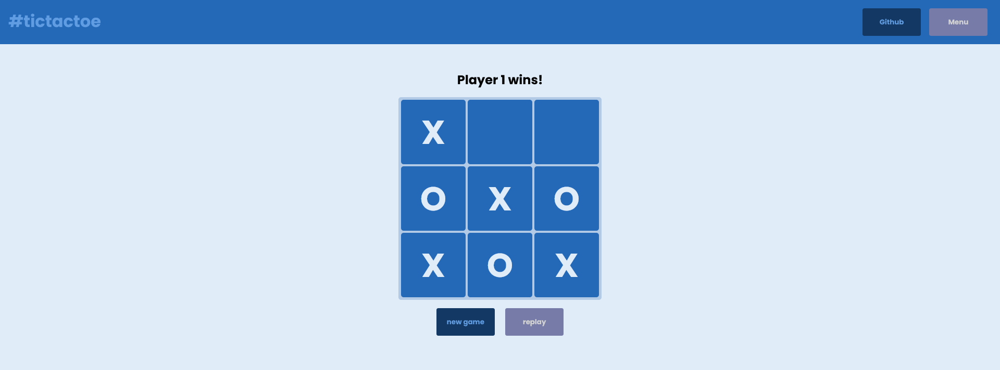

# ✏️ tictactoe

A Vanilla JS TicTacToe game implementation. 

## Table of contents
1. Requirements
2. Getting Started
3. Todo
4. Maintainers/Contributors
5. License

## ✔️ Requirements

* This app run in any modern browser.

## ⌨️ Getting Started

1. Clone or download the repository folder.
2. Open the index.html file.

## ✔️ Todo

* Multi-language support
* Sounds
* A.I. player 2.
* WebSockets back-end for multiplayer.

## 👨‍💻 Maintainers/Contributors

* David Costa - [davidshosta@gmail.com](mailto:davidshosta@gmail.com)

## 📝 License

This project is licensed under the MIT GENERAL PUBLIC LICENSE - see the [LICENSE](LICENSE) file for more details.

**Open Source Software** Hell Yeah!!! ヽ(・∀・)ﾉ